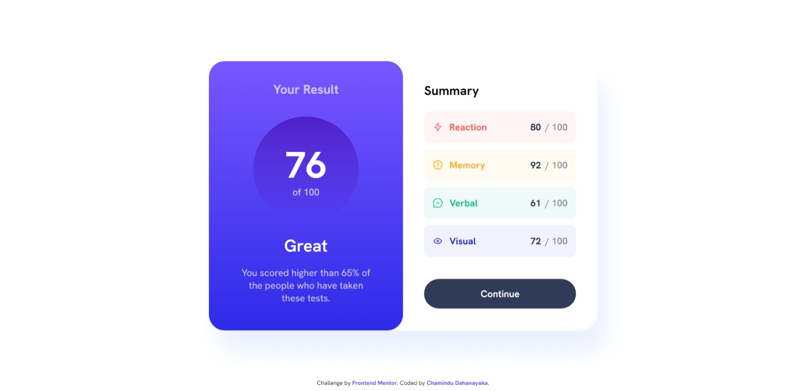

# Frontend Mentor - Results summary component solution

This is a solution to the [Results summary component challenge on Frontend Mentor](https://www.frontendmentor.io/challenges/results-summary-component-CE_K6s0maV). Frontend Mentor challenges help you improve your coding skills by building realistic projects. 

## Table of contents

- [Overview](#overview)
  - [The challenge](#the-challenge)
  - [Screenshot](#screenshot)
  - [Links](#links)
- [My process](#my-process)
  - [Built with](#built-with)
  - [What I learned](#what-i-learned)
  - [Continued development](#continued-development)
- [Author](#author)

## Overview

### The challenge

Users should be able to:

- View the optimal layout for the interface depending on their device's screen size
- See hover and focus states for all interactive elements on the page
- **Bonus**: Use the local JSON data to dynamically populate the content

### Screenshot



### Links

- Solution URL: [Solution URL here](https://your-solution-url.com)
- Live Site URL: [Live site URL here](https://your-live-site-url.com)

## My process

### Built with

- Semantic HTML5 markup
- Flexbox
- CSS Grid
- Mobile-first workflow
- JSON data

### What I learned

In this project, I learned to use below code snippets:

```css
.section1{
  background: linear-gradient(hsl(252, 100%, 67%), hsl(241, 81%, 54%));
  display: grid;
  place-items: center;
  place-content: center;
}
```
```js
try{
  const response = await fetch('data.json');

  if(!response.ok){
    throw new Error("Could not fetch resource");
  }

  const data = await response.json();
        
  reactionScore.innerHTML = data[0].score;
  memoryScore.innerHTML = data[1].score;
  verbalScore.innerHTML = data[2].score;
  visualScore.innerHTML = data[3].score;
  finalScore.innerHTML = Math.round((data[0].score + data[1].score + data[2].score + data[3].score)/4);
  }
  catch(error){
    console.error(error);
}
```

### Continued development

I'm looking to improve my CSS & JavaScript knowledge to design more unique and new stuff.

## Author

- Frontend Mentor - [@ChaminduD](https://www.frontendmentor.io/profile/ChaminduD)
- LinkedIn - [Chamindu Dahanayaka](https://www.linkedin.com/in/chamindudahanayaka/)